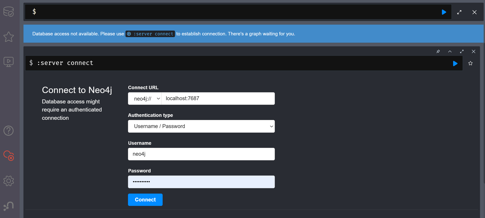
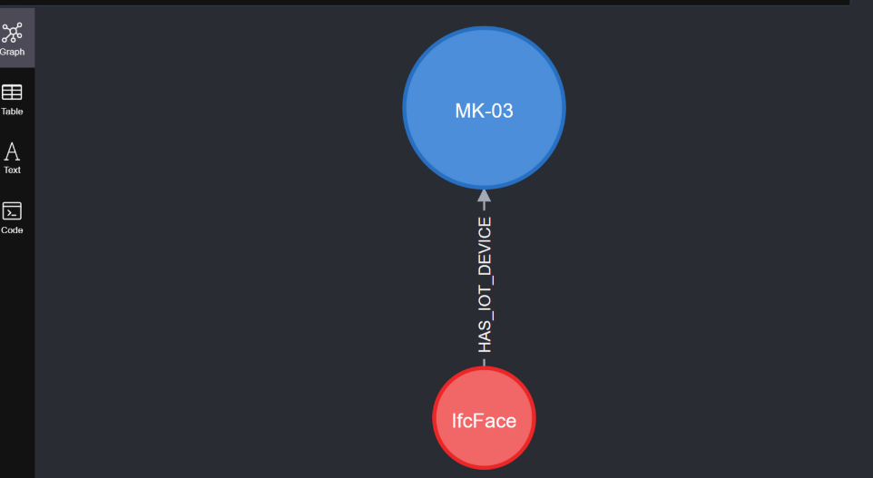

# TBDMProject

This project facilitates the conversion of Industry Foundation Classes (IFC) files into a Neo4j graph database, 
enabling enhanced analysis and visualization of building information models (BIM).

## Requirements

- Python Version: 3.8.0
- Libraries
  1. **_IfcOpenShell_**-python 0.6.0 for Python 3.8 64-bit Windows
  2. **_py2neo_**
  3. **_Neo4j Graph Data Science (GDS) Library_**: facilitates the execution of advanced graph algorithms and machine learning workflows within the Neo4j environment.
- Graph Database:
  - Neo4j

## Installation
1. Clone the Repository:
    ```
    git clone https://github.com/Nobuho/IFC-Neo4j-converter.git
    ```
2. Install Required Libraries:
- **IfcOpenShell-python**: Download the appropriate version for Python 3.8 64-bit Windows from https://ifcopenshell.org/downloads.html
- **py2neo**: Install via pip:
   ```
   pip install py2neo
   ```
- **graphdatascience**: Install via pip:
   ```
   pip install graphdatascience

   ```
  This client enables seamless integration with the Neo4j Graph Data Science (GDS) library, allowing for advanced graph algorithms and machine learning workflows directly from Python.


## Usage

1. Deploy a Neo4j instance using Docker Compose

    In the directory containing the docker-compose.yml file, exe

        docker-compose up -d


2. Access the database using Neo4j Browser
    - URL: http://localhost:7474/browser/
    - Username: neo4j
    - Password: diegodiego

    

3. Classes into package "ifc_neo4j_converter"
- ifc_neo4j_converter_AllSameNode.py
- ifc_neo4j_converter_EachClass.py

  Both classes convert an IFC file into a graph on Neo4j, but the graph structure is different:

|                          | ifc_neo4j_converter_AllSameNode.py           | ifc_neo4j_converter_EachClass.py                                        |
|--------------------------|----------------------------------------------|------------------------------------------------------|
| Neo4j node type          | All nodes have the `:IfcNode` label          | Each node has its own class as a label              |
| Relationships (edges)    | Source ID, Target ID, Relationship type      | Also includes source and target classes             |
| Relationship creation queries | Uses single label `:IfcNode`             | Uses specific label for each IFC class              |
| Purpose                  | Simplicity and uniformity                    | More detail and precision in structure              |
| Useful for               | General analysis or simple debugging         | Targeted queries (e.g., all walls, all windows)     |


- ifc_neo4j_converter_ToCsv.py
The class extracts nodes (objects) and edges (relationships) from the IFC file and saves them into CSV files suitable for importing into a Neo4j graph database.

4. To analyze the graph create before, run classes into the package "ifc_analyzer"
5. **Class CentralityAnalyzer**.
   The betweenness centrality analysis measures how often a node lies along the shortest paths between other nodes in the graph. A node with a high score is a key point for connecting entities.
   
    Before we can analyze the BIM data, we need to project the graph using the GDS library.
    We do this with the following Cypher command in neo4j Browser:

    ```
   CALL gds.graph.project(
   'IfcOpenHouseGraph',  // Nome del grafo
   '*', // Tutti i nodi
   '*'  // Tutte le relazioni
   );
    ```
   
    To do centrality analysis, insert this query Cypher command in neo4j Browser:

      ```
   CALL gds.betweenness.stream('{self.graph_name}')
   YIELD nodeId, score
   MATCH (n) WHERE id(n) = nodeId
   RETURN n.elementId AS id, n.ClassName AS class, score AS centrality
   ORDER BY score DESC
   LIMIT {limit};
    ```
    
    
6. The class "IoTDevice.py" is utilize to connect a node (a sensor IoT), to other node in the graph "IfcOpenHouseGraph".

    This script is designed to create a node representing an IoT device (e.g., a temperature sensor)
    and link it to an existing IfcNode within a Neo4j graph database.
    The IoTDevice node is created with specific attributes such as the device ID, type, and additional properties
    (optionally including a custom class name).
    Afterward, a relationship of type HAS_IOT_DEVICE is established between the existing IfcNode (identified by its ID)
    and the newly created IoTDevice node. This represents the connection between a building element from the IFC model
    and a physical or virtual sensor being monitored as part of the digital twin.

    To view the new relation of the newly created object, we can insert this query Cypher command in neo4j Browser:
    ```
    MATCH (n:IfcNode)-[:HAS_IOT_DEVICE]->(iot:IoTDevice)
    RETURN n, iot;
    ```
    
    
7. Class Neo4jToIfcExporter.py
   
   This script connects to a Neo4j graph database and exports information into an IFC (Industry Foundation Classes) file.
   It focuses on extracting both building elements (e.g., IfcNodes) and IoT devices (e.g., sensors) stored as nodes in the graph.
   The goal is to preserve semantic connections between IoT devices and digital building components in a format that can be
   used for simulation, visualization, or integration in BIM environments.

8. The package "output" is used to archive output files, created by analyze classes.

## Notes

- **Performance**: The time required for node and edge creation in Neo4j depends on the size of the IFC file. Larger files will take more time to process.

- **Compatibility**: Ensure that all software versions are compatible. The specified versions in this document have been tested.

- **Security**: The NEO4J_AUTH environment variable in the docker-compose.yml file sets the default username and password for Neo4j. It's advisable to change these credentials for production environments.

- **Documentation**: For comprehensive guidance on using the GDS Python client, refer to the official documentation https://neo4j.com/docs/graph-data-science-client/current/.